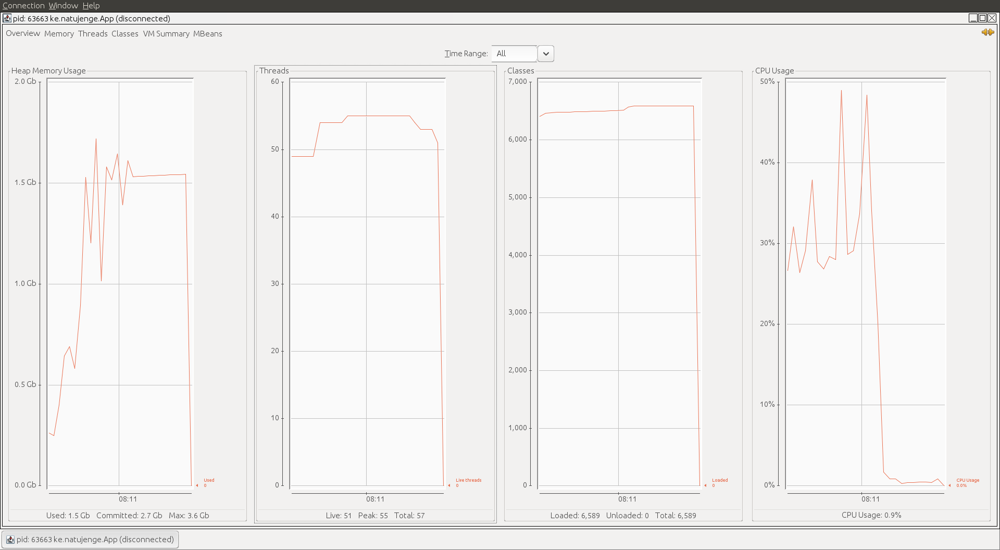
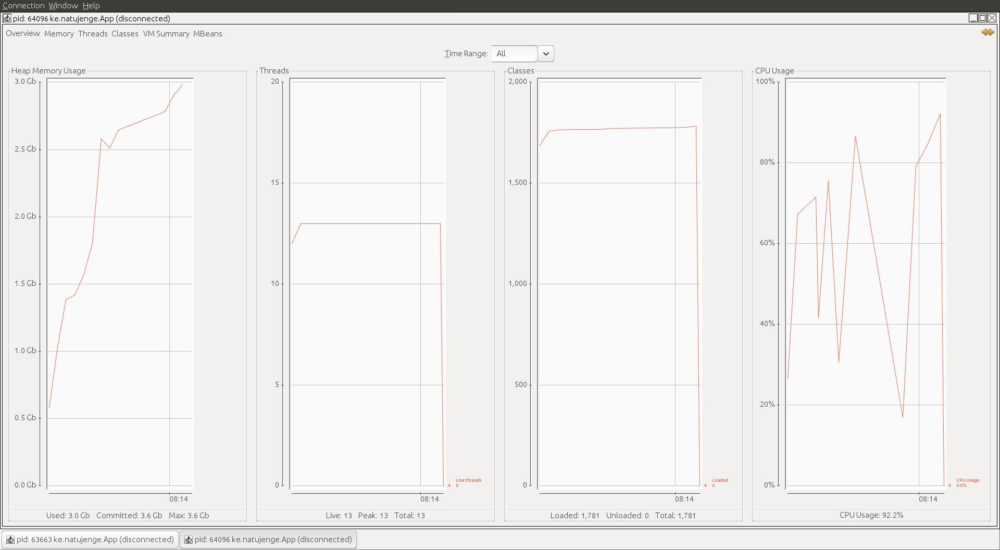

# Comparison of various cache technologies

## AIM
- The aim of this project is to track performance of different caching
technologies to help in decision-making.
- I am using a complex object randomly generated to illustrate the 
different complex objects we encounter in our day to day programming activities.

- After several trials, I noticed that Java Hashmap goes out of memory after 
storing 3485106 requests.

- I capped the requests at 3,375,000 to ensure each of them completes successfully. without memory error.
## Embedded Hazelcast

* Threads: total 57, live 51, peak 55
* Heap Memory: Used 1.5GB
* Classes: Loaded 6589 
* CPU Usage: max 48%, active AVG: 40%, idle: 0.9%

## Java Hashmap

* Threads: total 13, live 13, peak 13
* Heap Memory: Used 3.0GB
* Classes: Loaded 1781 
* CPU Usage: max 90%, active AVG: 60%, idle: unknown

## Testing
We run the program as showed in the start script, specifically passing the
D argument ``-Dcom.sun.management.jmxremote=true`` so that we can see the JVM 
stats in JVM monitoring solutions, e.g JConsole.

After running the program, start JConsole and select the process by
id or main class name.

Happy coding
